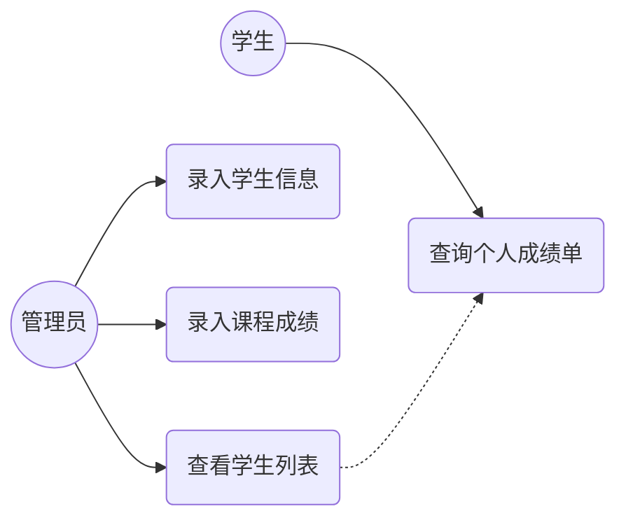
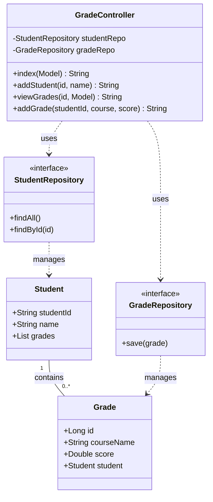
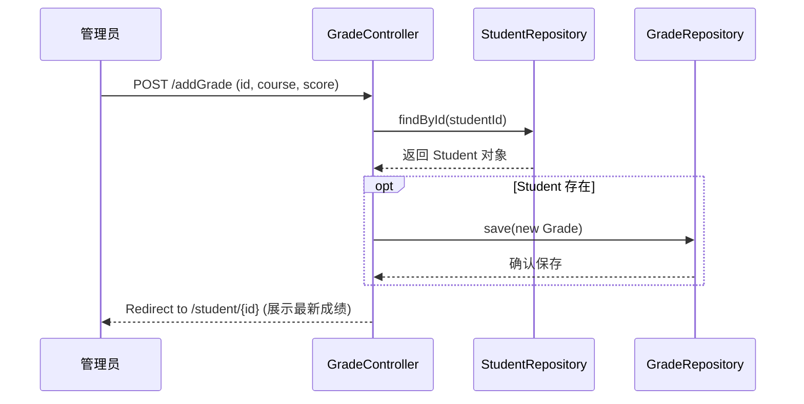
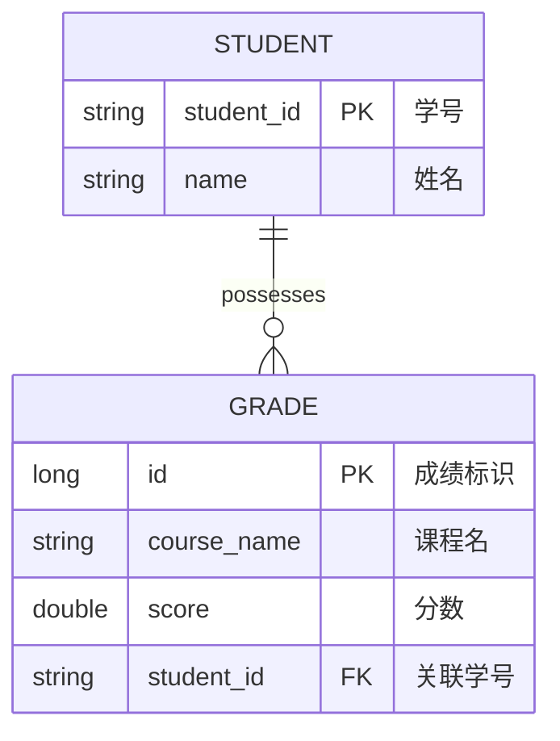

# 合肥工业大学自学考试实践考核报告

**课程名称**：软件工程（实践）  
**科目代码**：02334  
**实践项目**：学生成绩管理系统的分析与设计  
**技术栈**：Java, Spring Boot, Spring Data JPA, Thymeleaf, H2 Database

---

## 一、 需求分析

### 1.1 系统背景
在教育信息化背景下，学生成绩管理是学校日常工作的核心环节。本项目旨在开发一套轻量级的 B/S 架构系统，实现学生信息的录入、课程成绩的关联管理及可视化查询，提高管理效率。

### 1.2 功能需求
1. **学生管理**：支持录入学生基本信息（学号、姓名）。
2. **成绩录入**：支持为指定学生添加多门课程的成绩。
3. **综合查询**：管理员可查看学生列表，点击进入详情页查看该生所有科目的成绩分布。

### 1.3 用例图 (UML Use Case Diagram)


---

## 二、 系统设计

### 2.1 软件架构设计
系统采用经典的 **MVC (Model-View-Controller)** 模式，实现业务逻辑与展示层的解耦：
- **Model**：由 JPA 实体类定义，映射至 H2 数据库。
- **View**：Thymeleaf 模板引擎动态渲染 HTML。
- **Controller**：Spring MVC 处理 HTTP 请求并协调数据流。

### 2.2 静态模型：类图 (UML Class Diagram)


### 2.3 动态模型：时序图 (UML Sequence Diagram - 添加成绩流程)


---

## 三、 数据库设计 (ER 图)

### 3.1 逻辑结构设计
系统核心实体为“学生”与“成绩”，它们之间存在 **1:N** 的关联关系。



---

## 四、 核心功能实现说明

### 4.1 数据持久化
利用 `Spring Data JPA` 的声明式接口，无需编写 SQL 即可完成 CRUD 操作。例如 `StudentRepository` 通过继承 `JpaRepository<Student, String>` 自动获得了按 ID 查询和全量查询的能力。

### 4.2 业务逻辑
在 `GradeController` 中，通过 `Optional` 安全处理学生查询逻辑，确保在添加成绩时只有当学生存在时才执行保存操作：
```java
studentRepo.findById(studentId).ifPresent(s -> {
    Grade g = new Grade();
    g.setStudent(s);
    g.setCourseName(courseName);
    g.setScore(score);
    gradeRepo.save(g);
});
```

---

## 五、 测试与验证

### 5.1 测试环境
- **操作系统**：Linux (Ubuntu/Debian)
- **开发工具**：VS Code + Java Extension Pack
- **构建工具**：Maven 3.x

### 5.2 关键测试用例
| 测试项目 | 输入数据 | 预期结果 | 实际状态 |
| :--- | :--- | :--- | :--- |
| 学生录入 | ID: 1001, Name: 张三 | 首页列表显示张三，数据库生成记录 | 通过 |
| 成绩关联 | ID: 1001, Course: 软件工程, Score: 95 | 详情页正确显示该门课程成绩 | 通过 |
| 异常处理 | 输入不存在的学号添加成绩 | 系统重定向，无报错，数据不入库 | 通过 |

---

## 六、 实践总结

通过本次《学生成绩管理系统》的开发实践，我深入掌握了以下软件工程核心要点：
1. **工程化流程**：从需求分析到 UML 建模，再到代码实现，体会了“先设计后编码”的重要性。
2. **框架技术应用**：Spring Boot 的自动配置机制极大减少了基础设施搭建的时间，体现了组件化开发的效率。
3. **数据一致性**：通过 JPA 维护外键关联（`@ManyToOne`），在应用层确保了成绩必须依附于学生，防止了孤立数据的产生。

本系统架构清晰，扩展性强，具备进一步开发权限管理（Spring Security）和复杂报表分析的潜力。
